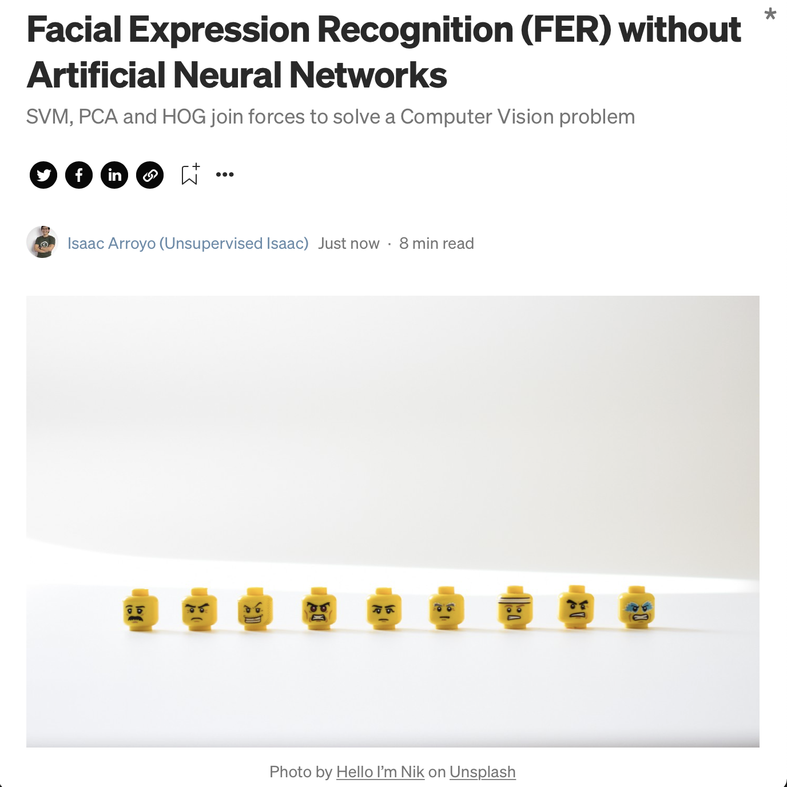

# Facial Expression Recognition (FER) without Artificial Neural Networks
**SVM**, **PCA** and **HOG** join forces to solve a Computer Vision problem.

## Content
In this repository you can find the notebook and scripts used in the Medium post 
["Facial Expression Recognition (FER) without Artificial Neural Networks"](https://towardsdatascience.com/facial-expression-recognition-fer-without-artificial-neural-networks-4fa981da9724)

</img>

* [**Data transformation**](https://github.com/isaacarroyov/fer_without_ann/tree/main/scripts)
* [**HOG Descriptor class**](https://github.com/isaacarroyov/fer_without_ann/blob/main/notebooks/OwnTransformers/ImageDescriptors.py)

## Software requirements
If you want to replicate the code I recommend installing the following **Python** libraries:

**Documentation of the code**
* [Jupyer Lab](https://jupyter.org/install)

**Data manipulation**
* [NumPy](https://numpy.org/install/)
* [Pandas](https://pandas.pydata.org/getting_started.html)

**Data visualization**
* [Matplotlib](https://matplotlib.org/stable/users/installing/index.html)
* [Seaborn](https://seaborn.pydata.org/installing.html)

**Image manipulation**
* [OpenCV](https://pypi.org/project/opencv-python/)
* [scikit-image](https://scikit-image.org/docs/stable/install.html)

**Machine Learning**
* [Scikit-Learn](https://scikit-learn.org/stable/install.html)

